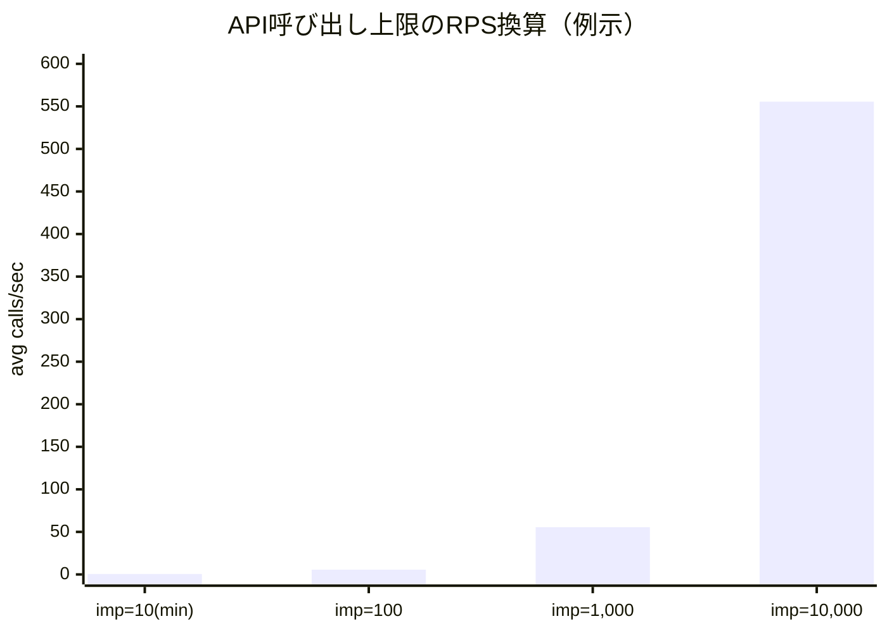
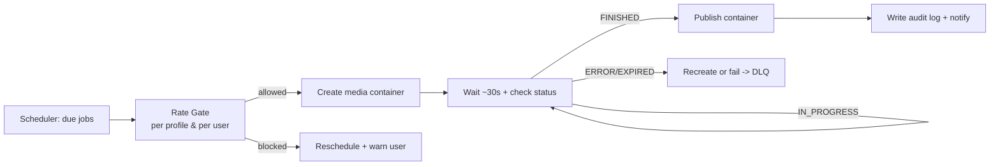
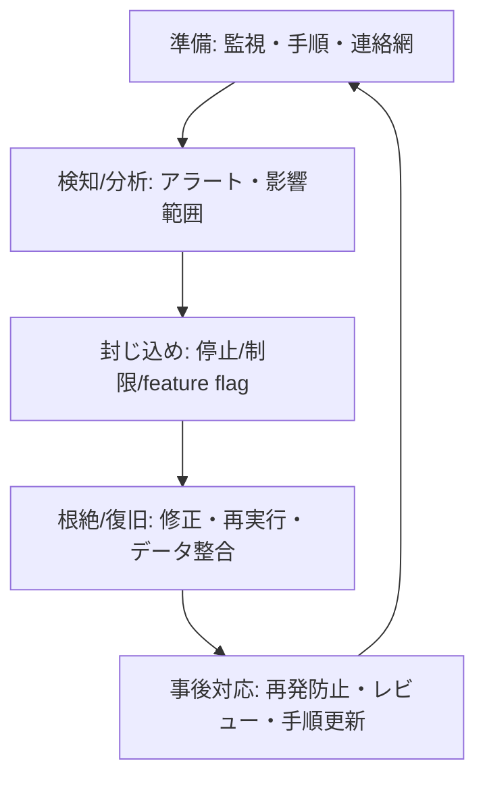

# Threads向け自動投稿・自動返信SaaS開発・運用の注意点レポート

## エグゼクティブサマリ

Threads向けの自動投稿・自動返信SaaSを「実際に」開発・運用する際の最大の論点は、(1) **公式APIの制約（上限・仕様・非同期処理）**を前提にした設計、(2) **プラットフォーム規約・ポリシー（自動化/データ取り扱い/削除要求）**に沿った運用統制、(3) **運用事故（誤投稿・重複投稿・スパム判定・トークン失効・Webhook逸失）**をプロダクト側で“起こりにくくする”実装、の3点である。特に、投稿は24時間移動で250件、返信は同1,000件というプロフィール単位の制約が明記されており、予約投稿や大量返信のSaaSでは上限管理が必須になる。citeturn2search1turn3search0turn0search0

また、Graph API系のレート制限として「24時間の呼び出し回数＝4800×インプレッション数（最低10に補正）」という計算式や、到達時に呼び出しを止める等のベストプラクティスが提示されているため、**アプリ全体/ユーザー別のレート制御・バックオフ・可観測性**が運用の成否を左右する。citeturn3search7turn8search0turn8search6

返信オートメーションは、無人で大量に返すほどリスクが増える。Threadsには「返信を承認制にする（Reply approvals）」機能があり、APIでも承認制投稿の作成・保留返信の管理が可能とされるため、SaaSとしては **“半自動（AI案＋承認＋監査）”** を標準にし、スパム/炎上/誤返信の事故率を下げる設計が実務的に優位である。citeturn3search3turn3search6turn3search15

セキュリティ/法務面では、entity["company","Meta","social technology company"] のプラットフォーム規約に基づくデータ削除導線（データ削除コールバックURL等）を必ず用意し、削除要求の処理を運用手順に組み込む必要がある。加えて、無許可の自動データ収集（スクレイピング等）を禁じる条項が明確であり、公式API外の自動化（画面操作/RPAでDMを読む等）を事業の中核に据えるのは高リスクである。citeturn6search0turn6search9turn7search6turn7search24

本レポートは、上記の一次情報（Meta公式ドキュメント/規約、SaaS公式サポート等）を軸に、設計・実装・インフラ・運用・セキュリティ・プロダクト運営の各観点で「要点・理由・具体注意・チェックリスト・推奨対策」を実務向けに整理する（未指定の前提は都度「未指定」と明記）。citeturn2search1turn5search3turn4search24turn6search0

## 設計

**要点（設計原則）**  
Threads向けSaaSの設計は、(a) **API制約をUI/データモデルに焼き込む**、(b) **チーム運用（権限・承認・監査）を最初から中核にする**、(c) **後から“規約対応”できない領域（データ削除、ログ、同意）を初期から入れる**、の3つを原則にするのが安全である。理由は、投稿・返信の上限やレート制限は後付けだと既存顧客の運用を壊しやすく、かつMeta側のエンフォース（制限/停止等）リスクがあるため。citeturn2search1turn3search7turn7search1turn6search0

**理由（Threads固有の“設計に影響する制約”）**  
最低限、以下はプロダクト設計に直結する。テキスト投稿は500文字、長文は「Text attachments」で最大10,000文字＋リンクという別機能、投稿は24時間移動で250件上限、返信は同1,000件上限、メディアコンテナは作成後に平均30秒待ってからpublish推奨、さらにpublishせず24時間を超えるとコンテナがEXPIREDになりうる。これらは「予約投稿」「スレッド投稿」「メディア投稿」「自動返信（返信作成）」のUX/ジョブ設計を決める。citeturn2search11turn4search0turn2search1turn3search0turn4search1turn5search10

**実装上の具体的注意点（機能要件・UX）**  
- **投稿エディタ**は「500文字/長文添付」「ハッシュタグ（Topics）上限」「メディア制約」を入力時点で弾く。特にThreadsは1投稿あたりTopics（ハッシュタグ相当）が実質1つになる運用が一般的で、Buffer等の運用ガイドでも“1つのみ”が明示されているため、UIで明確に制御する。citeturn2search11turn4search0turn4search24turn4search6  
- **スケジュール投入**は、投稿250/日・返信1000/日の上限を「ユーザー（Threadsプロフィール）×24時間移動窓」で管理する。予約が多い顧客ほど、未来の予約が“上限超過で将来失敗する”可能性があるため、(1) 予約時に警告、(2) 実行時にブロック、(3) 代替案（時間ずらし）提示、を揃える。citeturn2search1turn3search0  
- **返信運用UX**は“無人自動返信”よりも「受信→分類→AI案→承認→送信」を標準にする。Threadsには返信承認（Reply approvals）機能があり、APIでも承認制投稿の作成と保留返信の管理が可能とされるため、炎上/スパム対策として「重要投稿は承認制デフォルト」を選べる設計が現実的。citeturn3search3turn3search15turn3search6  

**権限設計（RBAC/監査）**  
B2Bの運用事故の多くは「誰が何をできるか」が曖昧なことから起きる。最小でも Workspace（顧客組織）単位で、Owner/Admin/Editor/Approver/Analyst/Read-only を分け、承認必須の投稿種別（例：公式声明・謝罪・価格改定）を“ルール化”できるようにする。Meta側も規約違反時のエンフォースを明記しているため、監査ログと権限統制はプロダクト要件に含めるべき。citeturn7search1turn6search0

**データモデル（最小）**  
以下のエンティティは、後から追加すると移行が重くなるため初期から持つのが安全。  
- Workspace / Member / Role  
- ThreadsConnection（token・権限scope・有効期限・refresh状態）  
- ScheduledPost（原稿） / PublishAttempt（実行・結果） / MediaContainer（id・status）  
- InboxItem（reply/mention等） / ReplyDraft / ReplyDecision（approve/ignore/hidden等）  
- AuditEvent（誰が・いつ・何を・前後差分）  
これにより、コンテナ状態の追跡（IN_PROGRESS/FINISHED/ERROR/EXPIRED等）や、返信承認のワークフローを“証跡付き”で管理できる。citeturn5search10turn3search3turn7search1

**API利用設計（呼び出し上限・レート制限）**  
Graph APIのレート制限は「4800×インプレッション数（最低10）」という形で示され、到達したらAPI呼び出しを止める等が推奨されている。SaaS側は「投稿/返信のプロフィール上限」と「APIコールのレート制限」の両方を守る必要があるため、内部は必ず“レート制御レイヤ”を共通化し、全コンポーネント（予約実行、インサイト収集、Webhook再同期等）を経由させる。citeturn3search7turn8search0turn8search6

**監査ログ設計（証跡の粒度）**  
監査ログは「誰が何をしたか」だけでなく、投稿本文/メディア差分、承認者、AI利用の有無（プロンプト/モデル/設定）、Webhookイベントの受信・重複排除など、事故調査に必要な粒度で記録する。違反や不正が疑われる場合、開発者側のアクセス停止等の措置がありうるため、監査と再現性の確保は運用コストを下げる。citeturn7search1turn6search0

**チェックリスト（設計）**

| チェック項目 | 最低ライン | 推奨（実務） |
|---|---|---|
| 投稿250/日・返信1000/日を24h移動窓で計算 | 実行時ブロック | 予約時に将来超過も予測し警告 citeturn2search1turn3search0 |
| 500文字/10,000文字添付のUX分岐 | 入力制限 | 長文添付テンプレ/プレビュー citeturn2search11turn4search0 |
| Topics（ハッシュタグ）制約をUIで制御 | 注意書き | 2個目以降は自動で通常テキスト化/警告 citeturn4search24turn4search6 |
| 承認フロー（役割/段階） | 1段承認 | 投稿種別ごとに必須承認者を設定 citeturn3search3 |
| 監査ログ（差分・理由） | 主要操作のみ | AI利用・承認・削除まで完全追跡 citeturn7search1turn6search0 |
| データ削除導線（ユーザー要求） | URL提示 | コールバック自動処理＋証跡 citeturn6search9turn5search3turn6search0 |
| レート制御レイヤ共通化 | 一部のみ | 全API呼び出しが必ず通る citeturn3search7turn8search0 |
| 返信の“半自動標準” | 手動のみ | AI案＋承認＋返信承認機能活用 citeturn3search3turn3search15 |

**推奨対策（設計の意思決定）**  
- 「自動返信」を売りにする場合でも、デフォルトは**承認必須**＋**返信承認（Reply approvals）活用**に寄せ、無人自動は“実験機能”として隔離する。citeturn3search3turn3search15  
- “運用で守る”ではなく“プロダクトで事故らせない”方針（上限予測、入力制約、承認、監査）を設計の中心に置く。citeturn2search1turn7search1  

## 実装

**要点（主要コンポーネント）**  
Threads向けSaaSの実装は、(1) OAuth/トークン、(2) 投稿パイプライン（コンテナ作成→状態確認→publish）、(3) 返信/メンション受信（Webhook＋再同期）、(4) レート制御・バックオフ、(5) 監査ログ、(6) CI/CDとテスト、に分解するのが安定する。特にメディア投稿は“非同期”で、状態を見ずにpublishすると失敗しやすい。citeturn4search1turn5search2turn5search10

**理由（失敗が起きる典型パターン）**  
最頻出の失敗は、トークン失効（60日更新漏れ等）、メディアコンテナの処理未完了、レート制限到達（429/エラーコード4等）、Webhookの重複/欠落、そしてネットワーク由来のリトライが引き起こす重複投稿である。Threadsでは長期トークンが60日で更新可能条件もあるため、更新ジョブの実装が必須。citeturn2search2turn2search9turn8search24turn5search10

**API呼び出し設計（投稿：コンテナ→publish）**  
メディア投稿は「コンテナ作成→平均30秒待機→publish推奨」で、さらにGETでコンテナのpublish状態を取得でき、状態にはFINISHED/IN_PROGRESS/ERROR/EXPIRED/PUBLISHED等がある。実装では“待機の固定sleep”だけに依存せず、(a) まず30秒程度待機、(b) statusを確認、(c) IN_PROGRESSなら指数バックオフで再確認、(d) EXPIREDなら再作成、が再現性の高い作りになる。citeturn4search1turn5search2turn5search10

**エラーハンドリング（分類と対処）**  
Metaのレート制限ガイドは、制限到達時は呼び出しを止め、ヘッダー等で状況把握し、クエリを分割して間隔を空ける等を推奨している。したがって実装は、(1) **再試行してよい失敗**（一時的な429/5xx/IN_PROGRESS）、(2) **再試行しても無駄な失敗**（権限不足、入力制約違反）、(3) **人の介入が必要**（削除要求、承認待ち、EXPIREDの大量発生）に分類し、キューと通知の経路を分ける。citeturn8search0turn8search6turn8search14

**idempotency（重複投稿を防ぐ実装）**  
Threads API側に一般的な“Idempotency-Key”が保証される前提は置かず、SaaS側で以下を持つのが安全。  
- ScheduledPostに `dedupe_key`（workspace+account+scheduled_time+content_hash 等）を持たせ、PublishAttemptは `dedupe_key` をユニーク制約にする  
- 途中失敗で“同じ原稿を再実行”する場合、**既存のメディアコンテナID**や**publish済みID**を参照して再利用/中止できるようにする  
コンテナ状態にPUBLISHED等があるため、状態照会を“冪等性の根拠”に使える。citeturn5search10turn5search2

**テスト戦略（Metaアプリの開発/テスト機能）**  
Metaは開発中のアクセス制御としてApp Rolesを提供しており、テスター等の追加で限定公開テストができる。Threadsユースケースでもテスター追加（Threads Testers等）に言及があるため、(a) App Rolesにテスト用アカウントを追加、(b) 契約前に“投稿・返信・Webhook・削除要求”までのE2Eを通し、(c) レート制限到達やEXPIREDなどの異常系をシナリオ化する。citeturn11search1turn11search3turn11search7turn5search3

**CI/CD（安全に出すための実装論点）**  
- DBマイグレーションは“監査ログ/投稿履歴”を壊すと重大事故になるため、後方互換を保ちつつ段階リリースする  
- 返信自動化やAI生成は事故影響が大きいので feature flag で顧客別に段階解放する  
- 重要ジョブ（publish/返信）は“新旧両実装で二重送信しない”よう、切替時の排他制御を明確にする  
信頼性目標（SLO）を作り、エラーバジェットでリリース速度を制御する考え方が有効。citeturn9search0turn9search8

**チェックリスト（実装）**

| チェック項目 | 最低ライン | 推奨（実務） |
|---|---|---|
| メディア投稿の非同期処理 | 30秒sleep | statusポーリング＋バックオフ＋EXPIRED再作成 citeturn4search1turn5search10turn5search2 |
| エラー分類（retry可否） | 429のみ | 429/5xx/権限/入力/承認待ちで分岐 citeturn8search0turn8search14 |
| 冪等性（重複投稿防止） | 手動対応 | dedupe_key＋Attemptユニーク＋状態参照 citeturn5search10 |
| トークン更新（60日） | 手動更新 | 自動refresh＋失敗時の再認可導線 citeturn2search2turn2search9 |
| Webhook受信の重複排除 | なし | event_id等でde-dupe＋順序保証なし前提 citeturn3search5turn10search0 |
| テスト（App Roles/テスター） | 開発者のみ | テスター・テストアプリ・異常系シナリオ citeturn11search1turn11search3turn11search13 |
| 監査ログの差分記録 | 操作ログのみ | 本文/添付/承認/AI設定/結果まで citeturn7search1turn6search0 |

**推奨対策（実装の型）**  
- 投稿パイプラインは「状態遷移（state machine）」として実装し、IN_PROGRESS/FINISHED/PUBLISHED/EXPIRED/ERROR を明示的に扱う。citeturn5search10turn5search2  
- 返信機能は “承認フロー＋返信承認（Reply approvals）対応” を先に作り、無人自動は後回しにする（事故コストが桁違い）。citeturn3search3turn3search15  

## インフラ

**要点（スケーラブルにする観点）**  
Threads向けSaaSは、(1) ジョブキュー（予約投稿/インサイト収集/再同期）を中心に据え、(2) “ユーザー（Threadsプロフィール）単位”のレート制御を強制し、(3) Webhookとポーリングを併用し、(4) 監査ログとメトリクスで運用可能にする、のが基本形になる。特にGraph APIのレート制限は明示されており、到達時に呼び出しを止めるなどの設計が要求される。citeturn3search7turn8search0turn10search0

**理由（上限が“局所的”だからインフラ設計が難しい）**  
投稿上限（250/24h）や返信上限（1000/24h）はプロフィール単位で、同時にAPIコールもユーザー/アプリ文脈のレート制限がある。つまり、単純な全体RPS制限ではなく「テナント×アカウント×機能」別のレート制御が必要になる。citeturn2search1turn3search0turn3search7

**ジョブキュー設計（優先度・DLQ・再試行）**  
- キューは最低でも「publish系（高優先）」「同期/分析系（低優先）」に分ける  
- 再試行は“無限リトライ”にせず、EXPIREDや権限不足など非回復エラーはDLQ（死活キュー）へ送る  
- publish期限（コンテナEXPIRED）を考慮し、遅延が積み上がると失敗率が上がるため、キュー滞留時間を監視する  
コンテナ状態がEXPIREDになりうることが、設計上のタイムアウト要件になる。citeturn5search10turn5search2

**レート制御（推奨の数値レンジは“仮定”として提示）**  
未指定：対象顧客数、平均投稿数/日、平均インプレッション数、取得するインサイトの頻度。  
ここでは“設計を始めるための仮定”として、**1アカウントあたり 投稿10/日、返信50/日、インサイト収集（投稿別）1回/時、Webhook受信あり**と置く。

- APIコール上限（24h）は 4800×インプレッション数（最低10）なので、最小48,000コール/日（平均0.55RPS相当）という下限が示唆される。一方、インプレッションが増えると上限も増えるため、レート制御は“固定RPS”ではなく、ヘッダー/実測に基づく動的制御が望ましい。citeturn3search7turn8search6  
- 投稿/返信はプロフィール上限（250/1000）が絶対制約なので、publish/返信作成のスケジューラは、まずこの上限を守ることを最優先にする。citeturn2search1turn3search0  

**可観測性（Observability）**  
少なくとも、(a) publish成功率、(b) 予定時刻との差（publish遅延）、(c) コンテナ状態遷移の滞留（IN_PROGRESSが長い等）、(d) 429/エラーコード4の発生率、(e) トークン失効/更新失敗数、(f) Webhook受信遅延と欠落推定、をダッシュボード化する。SLO/SLA設計の基本として「何を指標（SLI）にするか」を先に決める、という考え方が有効。citeturn9search0turn9search8turn8search24

**主要数値（推奨値レンジ：未指定前提のモデル）**

| 指標 | ベータ（〜100アカ） | 本番（〜10,000アカ） | 根拠/注意 |
|---|---:|---:|---|
| publish遅延SLO（95%） | ≤60秒 | ≤120秒 | メディアは平均30秒待機推奨＋再試行余裕 citeturn4search1turn5search10 |
| キュー滞留許容（P95） | ≤2分 | ≤5分 | EXPIRED（24h）を避けるため“早期検知”重視 citeturn5search10 |
| 429発生率（週次） | <0.5% | <1% | レート制限到達時は呼び出し停止が推奨 citeturn8search0turn8search14 |
| トークン更新猶予 | 7日前から更新開始 | 14日前から更新開始 | 長期トークン60日、更新条件あり citeturn2search2turn2search9 |
| 監査ログ保持（未指定） | 90日（仮） | 1年（仮） | 規約/顧客要件で変動、要法務確認 citeturn6search0turn6search9 |

**レート制御の目安（例示グラフ）**  
以下は「Calls/24h = 4800×Impressions（min10）」をRPS換算した例（インプレッションが増えるほど上限が増える）。citeturn3search7

**投稿キューとレート制御のフロー（Mermaid）**

（平均30秒待機推奨、コンテナstatus、投稿上限250/24h、レート制限式は公式情報に基づく。）citeturn4search1turn5search10turn2search1turn3search7

**チェックリスト（インフラ）**

| チェック項目 | 最低ライン | 推奨（実務） |
|---|---|---|
| ジョブキュー分離 | 1本 | publish系/分析系/再同期系で分割 citeturn5search10 |
| DLQ・再試行上限 | なし | 非回復エラーはDLQ、回復は段階バックオフ citeturn8search14turn5search10 |
| レートゲート | 全体RPS | perプロフィール上限＋式に基づく動的制御 citeturn2search1turn3search7 |
| キュー滞留監視 | なし | EXPIREDリスクの早期検知アラート citeturn5search10 |
| 可観測性 | ログのみ | SLI/SLO＋ダッシュボード＋アラート citeturn9search0turn9search16 |
| コスト見積（未指定） | 月次概算 | コール数/保存量/AI使用量から積み上げ citeturn3search7turn2search2 |

**推奨対策（インフラ）**  
- “投稿/返信”は上限が明確なので **レートゲートを単一責務のサービス**として分離し、全API呼び出しが必ず通るようにする。citeturn2search1turn3search7  
- キュー滞留をSLO化し、滞留が増えたら先に分析ジョブを落とす（publish優先）設計にする。citeturn9search0turn9search16  

## 運用

**要点（運用を壊さないための設計）**  
運用フェーズの事故は「連携（OAuth）が切れる」「Webhookが止まる」「投稿が遅延/重複する」「削除要求に対応できない」の4系統に集約される。SaaS側は、ユーザーの作業が止まるポイント（再認可、失敗の再投入、障害時の代替運用）を“手順化＋UI化”する必要がある。citeturn2search2turn3search5turn6search9turn8search14

**アカウント連携フロー（Authorization Window・トークンライフサイクル）**  
Threads APIのGetting startedでは、Authorization Windowにより短期トークンを取得し、期限内なら長期トークン（60日）へ交換・更新できる旨が示されている。したがって運用は、(1) 初回連携（許可scopeの明示）、(2) 長期トークンへの交換、(3) 定期refresh（少なくとも期限前に実施）、(4) refresh失敗時の再認可導線、を標準手順にする。citeturn5search17turn2search2turn2search9

**Webhook運用（受信・検証・再同期）**  
Threads Webhooksは、サブスクライブしたトピック/フィールドの通知をリアルタイムに受け取れる（例：replies fieldを購読すると返信オブジェクトを含む通知が来る）。運用上は、(a) Webhookが来ない/遅延することを前提に、定期ポーリングで再同期する、(b) リトライや重複送信を前提に冪等に処理する、(c) 署名検証により偽装リクエストを排除する、が必要になる。Meta系WebhookではX-Hub-Signature-256で署名が付与される旨の公式フォーラム説明もあり、App Secret管理と検証実装が重要。citeturn3search5turn10search0turn10search30

**SLA/SLO（未指定：目標値は仮定）**  
未指定：顧客に提示するSLA、対象機能（投稿のみ/返信も含む）、営業時間外対応。  
ここではSLO設計の“型”を示す。entity["company","Google","technology company"] のSRE BookはSLOを「SLIで測る目標値/範囲」と定義しており、SLO→アラート→エラーバジェットで運用判断を回すことを推奨している。Threads向けSaaSでは、SLIとして「投稿成功率」「予定時刻との差」「Webhook処理遅延」「トークン更新成功率」を置くのが実務的。citeturn9search0turn9search8turn4search1

**サポート体制（問い合わせ分類）**  
一次切り分けは「顧客の設定問題」「Meta側制限（上限・レート・承認制）」「SaaS障害」「仕様変更」で分類し、顧客画面に“エラーの意味と次の手順”を返す。レート制限到達時に呼び出しを止める等の推奨があるため、429/コード4系は“時間を置く・再投入する”導線をテンプレ化する。citeturn8search0turn8search24turn8search14

**障害対応フロー（Mermaid：NIST型の最小運用）**  
entity["organization","NIST","us standards agency"] のインシデント対応ガイドは、準備→検知/分析→封じ込め/根絶/復旧→事後対応のライフサイクルを示している。SaaS運用手順もこれに合わせると整理しやすい。citeturn9search9

**チェックリスト（運用）**

| チェック項目 | 最低ライン | 推奨（実務） |
|---|---|---|
| トークン更新運用 | 手動 | 期限前自動refresh＋失敗時の再認可UI citeturn2search2turn2search9turn5search17 |
| Webhook死活監視 | なし | 受信間隔・失敗率・再同期ジョブで検知 citeturn3search5turn10search0 |
| 投稿遅延の検知 | なし | 予定時刻との差をSLI化しアラート citeturn9search0turn4search1 |
| 429/レート制限対応 | 都度対応 | “停止→待機→再投入”の定型runbook citeturn8search0turn8search14 |
| データ削除要求対応 | メール対応 | コールバック処理＋完了証跡＋期限管理 citeturn6search9turn6search1turn5search3 |
| 障害時の封じ込め | 手作業 | feature flagで機能単位停止 citeturn9search16turn9search8 |

**推奨対策（運用）**  
- “投稿できない”より“重複投稿”のほうが致命傷になりやすいので、障害時は **publish系を止めるフェイルセーフ**を優先する（手動再開可能にする）。citeturn8search14turn7search1  
- 削除要求は、規約・監督当局対応に直結するため、最初からプロセス化（受付→特定→削除→証跡→完了通知）する。citeturn6search0turn6search1turn6search9  

## セキュリティ

**要点（Threads連携SaaS固有の守るべき資産）**  
守るべき資産は、(1) Threads/Instagramアカウントに紐づくアクセストークン、(2) 投稿原稿・返信履歴（場合により個人情報を含む）、(3) 監査ログ、(4) Webhook受信基盤、である。Metaは規約違反時のエンフォースを明記しており、またプラットフォーム規約上のデータ処理・削除義務があるため、技術対策とプロセス対策の両方が必要。citeturn7search1turn6search0turn6search9

**認証・認可（自社SaaS内）**  
- Workspace分離（テナント分離）を前提に、RBACと最小権限を徹底する  
- “承認者だけがpublishを実行できる”など職務分掌をプロダクトで担保する  
- セッション/トークン管理は entity["organization","OWASP","web application security nonprofit"] のチートシート等のベストプラクティスに沿って、セッションID/トークンの保護を徹底する（ログやフロントエンド露出の禁止）。citeturn9search2turn9search6

**トークン保護（Threads/Instagramアクセストークン）**  
Threads APIは長期トークンが60日で、更新条件がある。したがって、(a) 保管はKMS等で暗号化、(b) アプリサーバ・ジョブワーカーのみ復号可能、(c) 監査ログにトークンを絶対に出さない、(d) 期限前更新＋失敗時の再認可、が必須。citeturn2search2turn2search9turn9search2  
また、許可（scope）はthreads_basic等の必要最小限を原則とし、返信作成等は threads_manage_replies のような権限が必要になるため、顧客への説明（なぜ必要か）と審査対応（該当する場合）を設計する。citeturn5search0turn5search1turn0search21

**Webhookセキュリティ（署名検証）**  
Webhookは外部から到達する入口なので、署名検証（X-Hub-Signature-256等）・HTTPS・リプレイ対策（timestamp/nonce相当の検討）を行う。Meta系Webhook署名の検証手順（payload+App SecretでSHA256）が示されているため、受信側はこれを実装し、検証失敗時は破棄する。citeturn10search30turn10search14

**データ削除・プライバシー（Meta規約と国内法の観点）**  
Metaのプラットフォーム規約ではユーザーが削除要求できることや、プライバシーポリシー記載どおりにPlatform Dataを処理することが求められる。また開発者ダッシュボードではデータ削除コールバックURL等の設定が求められ、削除要求の処理が運用上必須となる。citeturn6search0turn6search9turn5search3turn6search1  
日本で個人情報を扱う場合、監督当局はentity["organization","個人情報保護委員会","japan privacy regulator"] であり（本レポートは法的助言ではないが）、個人データの取り扱い・委託・越境移転・漏えい報告等の論点が生じうるため、データ最小化（保存しない/短期保持）を基本方針にする。citeturn6search3turn6search32

**禁止領域（スクレイピング等の非公式自動化）**  
Metaは「許可なく自動データ収集（Automated Data Collection）をしない」旨を明示しており、またスクレイピング対策に関する説明でも、無許可の自動化によるデータ取得が規約違反である旨を述べている。Threads API外の自動化（画面操作で取得する等）を中核機能にすると、停止・訴求不能・運用不能のリスクが高い。citeturn7search6turn7search24turn7search1

**チェックリスト（セキュリティ）**

| チェック項目 | 最低ライン | 推奨（実務） |
|---|---|---|
| トークン暗号化保管 | DB平文禁止 | KMS + 最小復号権限 + 監査 citeturn2search2turn9search2 |
| Webhook署名検証 | IP制限のみ | X-Hub-Signature-256検証＋リプレイ対策 citeturn10search30turn10search14 |
| RBAC/職務分掌 | Adminのみ | Approver分離＋承認必須ルール citeturn7search1 |
| データ削除導線 | URL掲載 | コールバック処理＋証跡＋期限SLO citeturn6search9turn5search3turn6search1 |
| ログの機密対策 | マスクなし | トークン/PIIマスキング＋アクセス制御 citeturn6search0turn9search2 |
| 非公式自動化の禁止 | 方針のみ | 実装レベルで遮断（SDK/監査で検知） citeturn7search6turn7search24 |

**推奨対策（セキュリティ）**  
- “削除要求対応”と“監査ログ”は、営業資料ではなく**プロダクト要件**として扱う（後から入れるとコストが跳ねる）。citeturn6search0turn6search9turn6search1  
- Webhookは「来る前提」ではなく「欠落する前提」で、署名検証＋再同期（ポーリング）＋冪等処理をセットで実装する。citeturn10search0turn10search30turn3search5  

## プロダクト運営と実行優先度アクションプラン

**要点（KPI設計）**  
プロダクト運営のKPIは、売上系より前に“運用の成功”を計測できる指標が必要になる。Threads向けでは、(1) 連携継続（有効トークン率、更新成功率）、(2) 投稿配信の信頼性（成功率、遅延）、(3) 返信運用の効率（処理時間、承認率、誤返信率）、(4) 規約/安全性（上限超過ゼロ、BAN疑義ゼロ、削除要求SLO遵守）、が「解約」と直結する。SLOの考え方（SLI→SLO→アラート）を取り入れると、運営判断が一貫する。citeturn9search0turn9search16turn2search2turn2search1

**価格プラン設計（未指定：方向性のみ）**  
未指定：ターゲット（SMB/代理店/大企業）、課金単位（席/アカウント/投稿数/AIクレジット）。  
Threadsは公式アプリ側にも予約投稿機能が浸透している前提で、単なる予約投稿はコモディティ化しやすい。従って課金根拠は「チーム運用（承認・監査）」「返信運用（受信箱＋AI案＋承認）」「安全機能（上限管理・スパム抑止）」に寄せるのが合理的で、Reply approvals等の機能を“安全パッケージ”として組み込むと説明しやすい。citeturn3search3turn3search15turn2search1

**チャネル戦略（実務）**  
- 代理店/運用代行：承認・監査・マルチアカが刺さりやすく、オンボーディング支援がCACを下げやすい（未指定のため一般論）  
- 直販SMB：失敗しない予約投稿＋最小の返信半自動（承認必須）で“事故らない”価値を届ける  
- 開発者向け：Postman等の公式コレクションを参照しながらAPIプロセスを透明化すると導入障壁が下がる（サポート工数削減）。citeturn5search9turn5search10

**法務対応（最低限の成果物）**  
- プライバシーポリシー（Platform Dataの処理目的・委託先・保持期間）  
- データ削除の手続き（コールバックURLまたは手順URL）  
- 利用規約（禁止行為：非公式自動化、スパム的利用の禁止、責任分界）  
Metaプラットフォーム規約は、プライバシーポリシー記載どおりの処理や削除要求導線を要求しているため、法務成果物はリリース要件になる。citeturn6search0turn6search9turn6search13

**ユーザー教育（“自動化の安全な使い方”を設計する）**  
- 上限（250/1000）とレート制限の説明、予約過多の危険性  
- 返信半自動の推奨（AI案は承認必須、炎上時の停止スイッチ）  
- Reply approvalsの使いどころ（重要投稿は承認制、スパム多発時の切替）  
ユーザー教育をUI内に埋め込む（エラー時の次の一手提示、テンプレ）ことでサポート工数が減り、継続率が上がりやすい。citeturn2search1turn3search3turn8search14

**MVP→拡張ロードマップ（Threads APIの進化を前提）**  
Threads APIは更新が続いており、2026年2〜3月にも返信/引用等に関するパラメータ追加が示されている。したがってロードマップは「MVPは安全に投稿・返信運用できる最小」「拡張で高度機能（承認、インサイト高度化、より豊富なIntent/パラメータ）」の順が堅い。citeturn3search6turn3search9turn10search24

**チェックリスト（プロダクト運営）**

| チェック項目 | 最低ライン | 推奨（実務） |
|---|---|---|
| KPI/SLI定義 | DAU/売上のみ | 連携継続・投稿成功率・遅延・削除要求SLOまで citeturn9search0turn6search1turn2search2 |
| 価格の根拠 | 予約投稿 | 承認/監査/返信半自動/安全機能を中心に citeturn3search3turn2search1 |
| 法務成果物 | Privacyのみ | 削除手順URL/コールバック＋利用規約＋委託管理 citeturn6search0turn6search9turn6search1 |
| ユーザー教育 | PDF | UI内ガイド＋失敗時の次アクション提示 citeturn8search14turn2search1 |
| API更新追従 | 不定期 | changelog監視＋影響分析＋段階ロールアウト citeturn3search23turn10search2turn3search9 |
| “停止スイッチ” | なし | 事故時に自動機能を即停止する機能 citeturn9search16turn7search1 |

### 実行優先度付きアクションプラン

**短期（今すぐ〜4週間）**  
1. 投稿/返信の上限（250/1000）とGraph APIレート制限式（4800×imp）を前提に、レートゲート・上限予測・UI入力制約を設計に固定する。citeturn2search1turn3search0turn3search7  
2. メディア投稿の状態管理（30秒待機＋statusポーリング＋EXPIRED再作成）を実装の最優先に置く。citeturn4search1turn5search10turn5search2  
3. データ削除導線（コールバックURL/手順URL）と削除処理のrunbookを作り、監査ログに“削除要求の証跡”を残す。citeturn6search9turn5search3turn6search1turn6search0  

**中期（1〜3か月）**  
1. Webhook受信（返信）＋再同期（ポーリング）＋署名検証をセットで入れ、受信箱（Inbox）を成立させる。citeturn3search5turn10search0turn10search30  
2. 返信半自動（AI案＋承認＋監査）を標準化し、Reply approvals対応を“安全機能”として提供する。citeturn3search3turn3search15  
3. SLO（成功率・遅延・トークン更新）とアラートを整備し、障害対応をNIST型で手順化する。citeturn9search0turn9search9turn9search16  

**長期（3〜12か月）**  
1. 権限/承認/監査を拡張し、代理店・大企業の統制要件（多段承認、エクスポート、保管要件）に対応する。citeturn7search1turn6search0  
2. Threads APIのchangelogを常時監視し、パラメータ追加等の変更を段階ロールアウト（feature flag）で安全に取り込む。citeturn3search23turn3search9turn10search24  
3. 非公式自動化（スクレイピング等）を排除するガードレール（監査・検知・利用規約・プロダクト制限）を強化し、ポリシーリスクを低減する。citeturn7search6turn7search24turn6search0